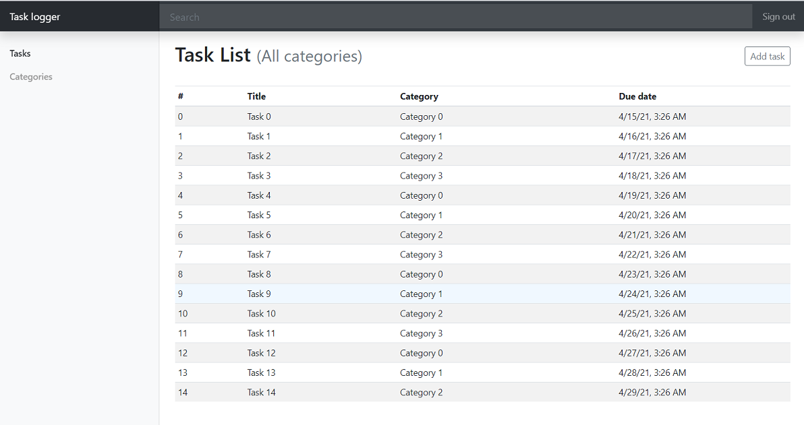
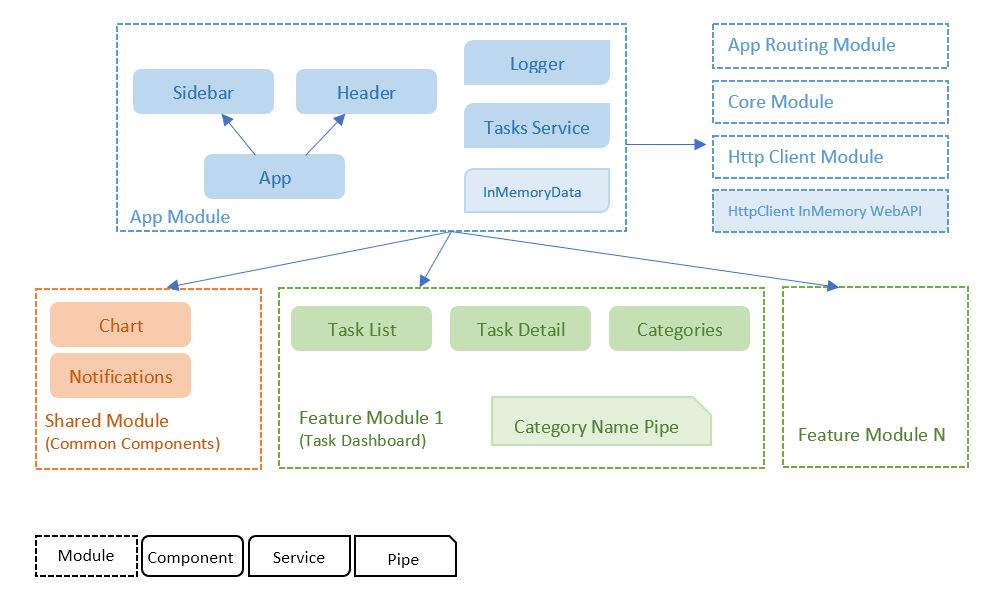
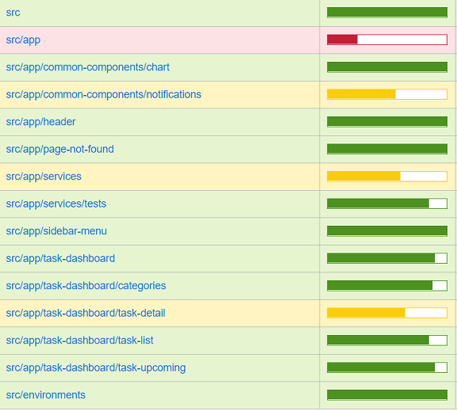

# Task Logger

## Story
Task logger is an application that allows you to create tasks. Each task can be created with a description, reminder date/time, a due date/time and a category. Charts display what categories and how many tasks are due in the next 7 days.

### Implementation requirements
- Angular v9+
- Routing
- Consume a data feed (XML, JSON etc.)
- Responsive layout

### Delivery requirement
- Source code that has been tested and is ready to be compiled and executed on any environment
- Any manual step in setting up should be scripted in automated manner (with tools like NodeJS, PowerShell, Visual Studio project file)
- Please deliver this in a publicly available repository like GitHub, BitBucket etc. with documentation about your concerns, decisions, guiding, testing etc. 

## Run the Application
Application execution requires Node.js and Powershell to be installed on your machine. To run the application clone or download the repository and run the script file `run.ps1` in root.

The `run.ps1` script will install the required packages, build and serves the app on default port `4200`. If this port is already in use on your machine, just press `y` when you are asked to use a different port.

## Architecture diagram
The image below shows the application building blocks and its architecture for the first development iteration. 
The detailed information about the decisions can be find in [ADR](./ADR.md).
At this stage, the scope is very limited, and everything is easy and understandable, so the current architecture works well. But before adding more feature and complexity to the project, we need to invest more in architecture to make it more scalable and maintainable.

## Testing
The image below shows the code coverage report. Tests are limited due to time constraint, there is a lot of room for improvement to include e2e tests and increase unit tests coverage.

## Rooms for improvement    
There are a lot of rooms for improvements, including the architecture, design, implementation and code quality, however a there are some considerations before trying to apply any improvements:

- **Time constraints:** Adding anything to the system needs time, not just for implementation, but also for design, test and document.
- **Priority:** There are a lot of things for design, implement and test and we should decide based on the priority.
- **Get feedback:** Before going far away, it is better to receive feedback from stake holders to see whether this is the same thing they have requested or not.
- **YAGNI and KISS:** I decide to not add anything unless I need it. For example, you see that the current architecture is very simple or there is no functionality for category which can be implemented later.

Considering above facts, here are a few of the items which I can plan for next development iteration:

**Architecture improvement:**
- Implementing proper abstraction layers. Adding an abstraction layer to decouple the presentation layer from core layer. 
- Refactoring code and project structure based on the new architecture and best practices.
- Improving entity definitions. Currently `Task` properties are optional to avoid strict null checking error. Need to find the best practice for creating a task without initializing its properties. Tasks can have different status.

**Functional and Implementation Improvement:**
- Adding pagination, sorting and search logic in both service and presentation layer.
- Enhancing the Category entity and adding CRUD operation for category.
- Enabling lazy loading of feature modules.
- Providing different options for user to get tasks in different due date per category.
- Capability of Showing a notification to the user based on tasks reminder setting.
- Add required configuration into environment variables where needed 
- Improve routing
- Adding proper exception handling
- Add localization and remove all hardcoded texts
- UX improvement
- Implementing the backend API to communicate with
- Add logger

**Tests improvement:**
- Improving test coverage at unit test level.
- Adding e2e tests.
