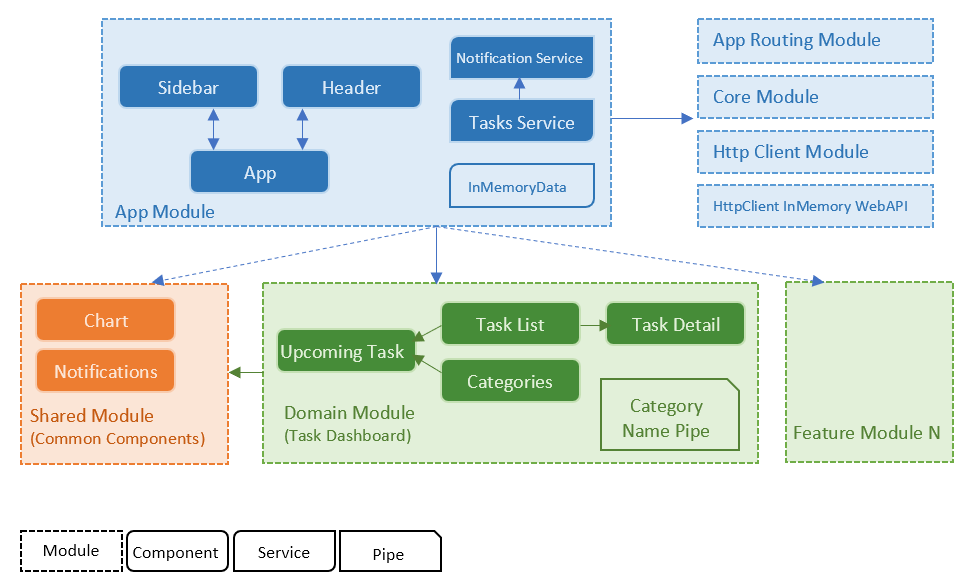

# Task Logger

## Story
Task logger is an application that allows you to create tasks. Each task can be created with a description, reminder date/time, a due date/time and a category. Charts display what categories and how many tasks are due in the next 7 days.

### Implementation requirements
- Angular v9+
- Routing
- Consume a data feed (XML, JSON etc.)
- Responsive layout

### Delivery requirement
- Source code that has been tested and is ready to be compiled and executed on any environment
- Any manual step in setting up should be scripted in automated manner (with tools like NodeJS, PowerShell, Visual Studio project file)
- Please deliver this in a publicly available repository like GitHub, BitBucket etc. with documentation about your concerns, decisions, guiding, testing etc. 

## Run the Application
Application execution requires Node.js and Powershell to be installed on your machine. To run the application clone or download the repository and run the script file `run.ps1` in root.

The `run.ps1` script will install the required packages, build and serves the app on default port `4200`. If this port is already in use on your machine, just press `y` when you are asked to use a different port.

## Architecture diagram
The image below shows the application building block and its architecture for the first development iteration. 
The detail information about the decisions can be find in [ADR](./ADR.md).
At this stage, the scope is very limited, and everything is easy and understandable, so the current architecture works well. But before adding more feature and complexity to the project, we need to invest more in architecture to make it more scalable and maintainable.

## Rooms for improvement    
Architecture improvement:
 - Implementing proper abstraction layers. Adding an abstraction layer to decouple the presentation layer from core layer. 
 - Code refactoring based on the new architecture.

Functionality Improvement:
- Adding pagination, sorting and search logic in both service and presentation layer.
- Enhancing the Category entity and adding CRUD operation for category.
- Enabling lazy loading of feature modules.
- Providing different options for user to get tasks in different due date per category.
- Capability of Showing a notification to the user based on tasks reminder setting.

Tests improvement:
- Improving test coverage at unit test level and adding e2e tests.
